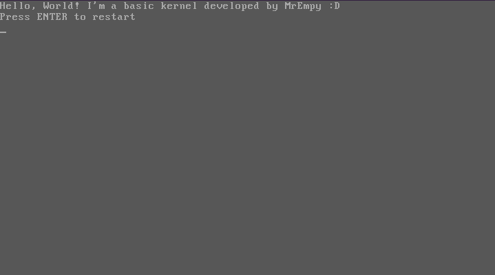

<h1 align="center">「💻」Simple Assembly Kernel</h1>

<p align="center"></p>

During my Assembly and C studies, I felt that I was putting into practice what I was researching and studying. So I decided to develop a simple sample Disk Operating System Kernel, known as DOS. The kernel features some very simple functionality based on basic input/output system (BIOS) switches.

## Functions
* LoadSystem
* DiskRead* Segment
11
* Stack
* DiskWrite
* CleanScreen
* SetBackGroundColor
* Println
* PressKey
* Reboot

## Compile
```
# Install QEMU on your machine to emulate the kernel
$ git clone https://github.com/MrEmpy/SimpleASMKernel
$ cd SimpleASMKernel
$ make
$ qemu-system-x86_64 build/basickernel.bin
```
